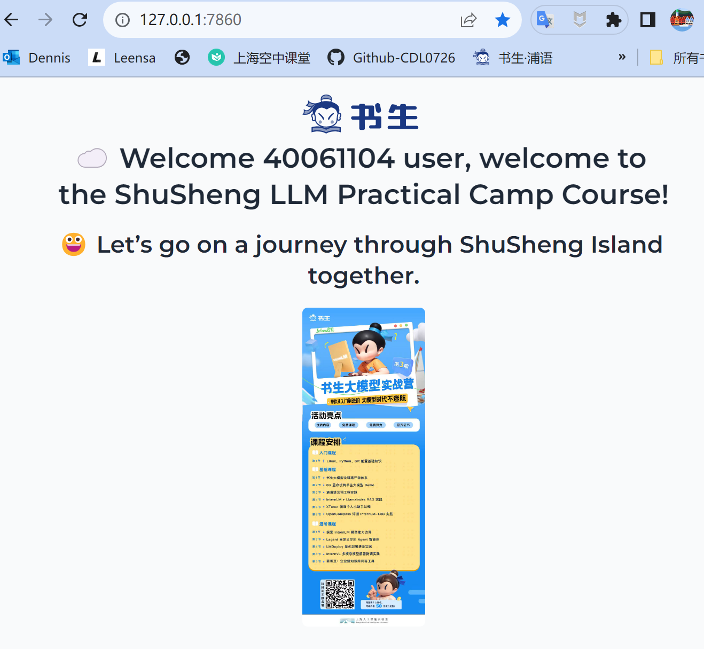
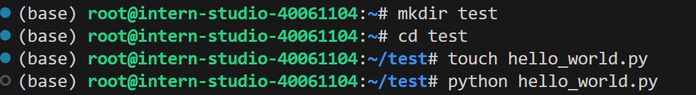
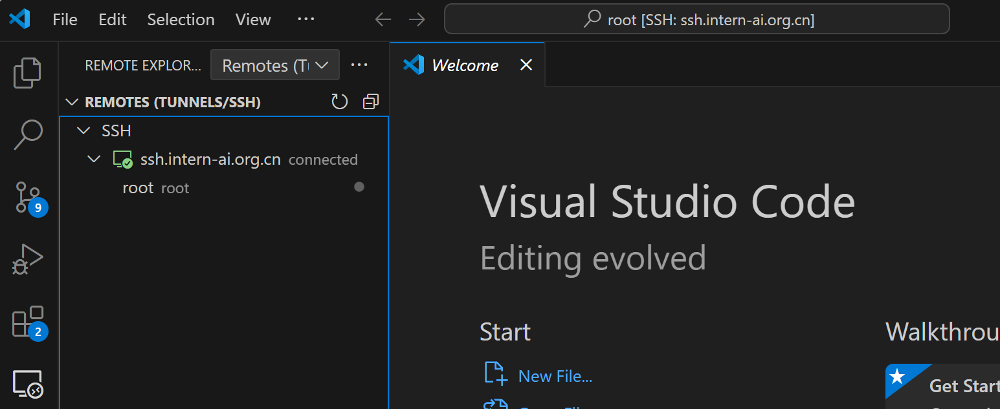
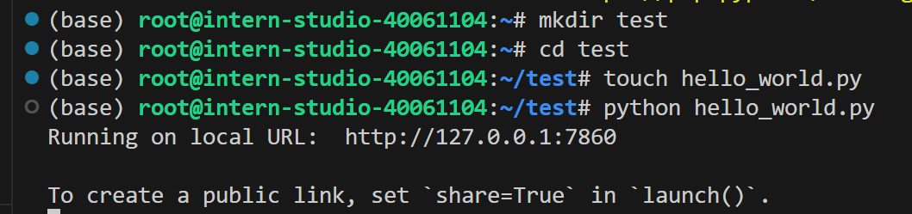
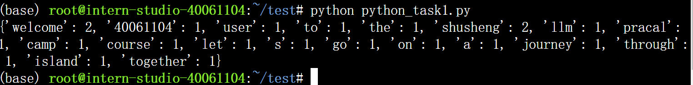
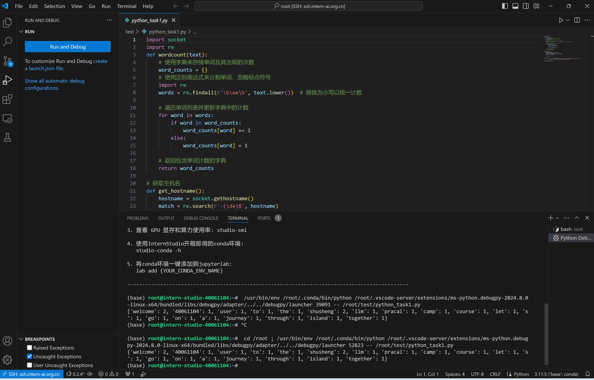
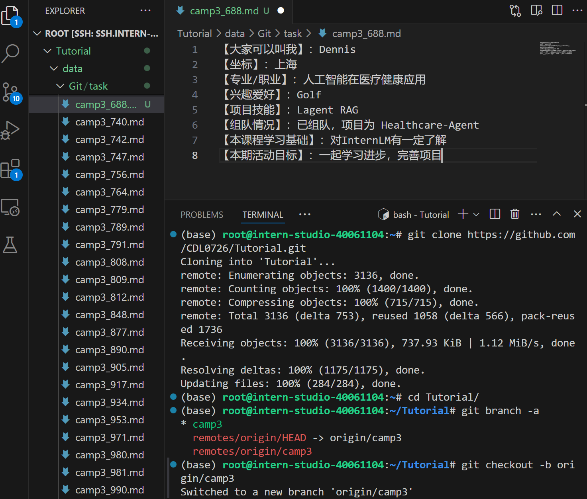
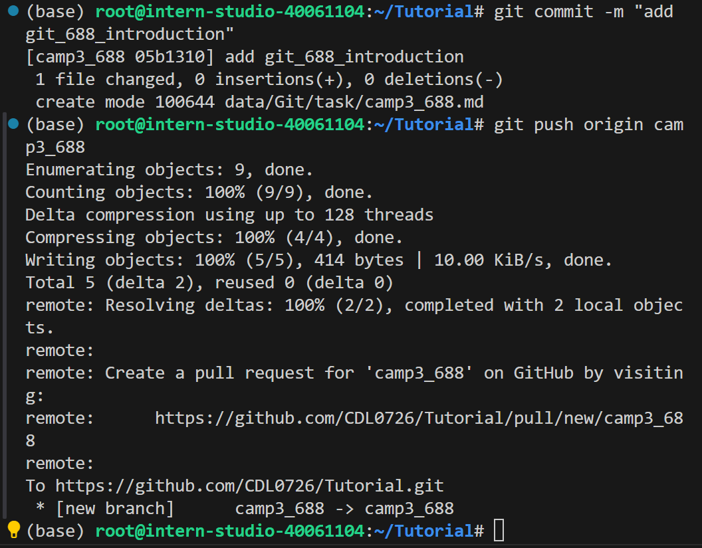

# InternLM-Tutorial
InternLM Tutorial and Project Development 

## 目标        
个人仓库，用于提交书生实战营的笔记、心得体会和分享项目。

## 超链接跳转      
[InternLM Tutorial GitHub仓库](https://github.com/InternLM/Tutorial)    

# 入门岛    
2024.7.10

## 第1关  L0-Linux 基础知识    

## 闯关任务作业    

**完成SSH连接与端口映射并运行`hello_world.py`**    

   

可选任务 1 将Linux基础命令在开发机上完成一遍     

  

可选任务 2 使用 VSCODE 远程连接开发机并创建一个conda环境    

  

可选任务 3 创建并运行`test.sh`文件    

  

任务提交地址：https://aicarrier.feishu.cn/share/base/form/shrcnZ4bQ4YmhEtMtnKxZUcf1vd    

## 第2关  L0-Python 基础知识

## 闯关任务

>- **任务1**: Python实现wordcount    
>- **任务2**: Vscode连接InternStudio debug笔记

## 基础知识    

**什么是conda**

Conda是一个开源的软件包管理系统和环境管理系统，它主要用于安装多个版本的软件包及其依赖关系，并能轻松地在它们之间切换。以下是关于Conda的详细介绍：

*功能与作用*：   

- **包管理**：Conda可以帮助用户轻松地安装、更新和卸载各种软件包。它提供了一个庞大而丰富的社区仓库——Anaconda仓库，内含数千个优化过并经过验证的常见Python软件包，也包含其他编程语言（如R）的工具。
- **环境管理**：使用Conda，用户可以创建独立且隔离的开发环境，为每个项目或应用程序设置不同的版本或配置文件，确保它们之间不会相互干扰，对于处理不同的依赖关系非常重要。
- **跨平台支持**：Conda适用于Windows、Mac和Linux，使在不同平台上共享代码变得更加容易，避免由于系统差异导致的问题。

**什么是debug？**    

当你刚开始学习Python编程时，可能会遇到代码不按预期运行的情况。这时，你就需要用到“debug”了。简单来说，“debug”就是能再程序中设置中断点并支持一行一行地运行代码，观测程序中变量的变化，然后找出并修正代码中的错误。而VSCode提供了一个非常方便的debug工具，可以帮助你更容易地找到和修复错误。    

*在vscode使用命令行进行debug*    

很多时候我们要debug的不止是一个简单的python文件，而是很多参数，参数中不止会有简单的值还可能有错综复杂的文件关系,甚至debug一整个项目。这种情况下，直接使用命令行来发起debug会是一个更好的选择。    

## 闯关任务作业    

**任务1: Python实现wordcount**    

 

**任务2: Vscode连接InternStudio debug笔记**

 

## References
1. [Python官方文档](https://docs.python.org/zh-cn/3/)
2. [书生大模型实战营 |第3期| L0-Python task](https://github.com/InternLM/Tutorial/blob/camp3/docs/L0/Python/task.md)
3. [书生大模型实战营 |第3期| 学员闯关手册](https://aicarrier.feishu.cn/wiki/XBO6wpQcSibO1okrChhcBkQjnsf)
4. [大佬笔记](https://github.com/WMing404/shusheng-demo/blob/main/notes/shusheng_notes.md)
 

## 第3关  L0-Git 基础知识

## 基础知识    

**Git 是什么**    

Git 是一种开源的分布式版本控制系统，广泛应用于软件开发领域，尤其是在协同工作环境中。它为程序员提供了一套必备的工具，使得团队成员能够有效地管理和跟踪代码的历史变更。下面是 Git 的主要功能和作用的规范描述：    

官网：[https://git-scm.com/](https://git-scm.com/)

官方文档：[Git - Book](https://git-scm.com/book/en/v2)

Git 基础：[Git 基础知识](https://aicarrier.feishu.cn/wiki/YAXRwLZxPi8Hy6k3tOQcuwAHn5g)    

**Git 中的一些基本概念**    

**工作区、暂存区和 Git 仓库区**
* 工作区（Working Directory）：
当我们在本地创建一个 Git 项目，或者从 GitHub 上 clone 代码到本地后，项目所在的这个目录就是“工作区”。这里是我们对项目文件进行编辑和使用的地方。

* 暂存区（Staging Area）：
暂存区是 Git 中独有的一个概念，位于 .git 目录中的一个索引文件，记录了下一次提交时将要存入仓库区的文件列表信息。使用 git add 指令可以将工作区的改动放入暂存区。

* 仓库区 / 本地仓库（Repository）：
在项目目录中，.git 隐藏目录不属于工作区，而是 Git 的版本仓库。这个仓库区包含了所有历史版本的完整信息，是 Git 项目的“本体”。

**文件状态**
文件在 Git 工作区中的状态可以是：

* 已跟踪：文件已被纳入版本控制，根据其是否被修改，可以进一步分为未修改（Unmodified）、已修改（Modified）或已暂存（Staged）。
* 未跟踪：文件存在于工作目录中，但还没被纳入版本控制，也未处于暂存状态。

**分支**
分支是 Git 的一大特性，支持轻量级的分支创建和切换。Git 鼓励频繁使用分支和合并，使得并行开发和错误修正更为高效。


## 闯关任务

>- **任务1**: 破冰活动：自我介绍    
>- **任务2**: 实践项目：构建个人项目

## 闯关任务作业    

### 任务1: 破冰活动：自我介绍

### 目标

> - 每位参与者提交一份自我介绍。
> - 提交地址：https://github.com/InternLM/Tutorial 的 camp3 分支～   

### 要求

> 1. 命名格式为 `camp3_<id>.md`，其中 `<id>` 是您的报名问卷ID。
> 2. 文件路径应为 `./data/Git/task/`。
> 3. 【大家可以叫我】内容可以是 GitHub 昵称、微信昵称或其他网名。
> 4. 在 GitHub 上创建一个 Pull Request，提供对应的 PR 链接。

### 实现步骤

>   1. 将该仓库的 camp3 分支 fork 到自己的 GitHub 仓库
>   2. 在 `./data/Git/task/` 目录下创建一个名为 `camp3_688.md` 的文件，其中 `<id>` 是您的报名问卷ID
>   3. 在文件中填写自我介绍内容
>   4. 提交 Pull Request，将自我介绍文件请求添加到 camp3 分支

**开发代码**
```
git clone https://github.com/CDL0726/Tutorial.git # 修改为自己frok的仓库
cd Tutorial/
git branch -a
git checkout -b camp3 origin/camp3

git checkout -b camp3_688 # 自定义一个新的分支

touch ./data/Git/task/camp3_688.md # 修改为自己的问卷ID

git add .
git commit -m "add git_688_introduction" # 提交信息记录

git push origin camp3_688
```
显示效果：
  
 

### 任务2: 实践项目：构建个人项目    

>- 实践项目： Healthcare-Agent 医疗智能体
>- 项目地址: https://github.com/CDL0726/Healthcare-Agent

## References
1. [Github仓库的Fork与PR(Pull Request)教程](https://www.bilibili.com/video/BV1bd4y1J7Vt/?spm_id_from=333.337.search-card.all.click&vd_source=427d5b3bd6552cd66c00e381e2aae338)
2. [Git关卡任务](https://github.com/InternLM/Tutorial/blob/camp3/docs/L0/Git/readme.md)
   

